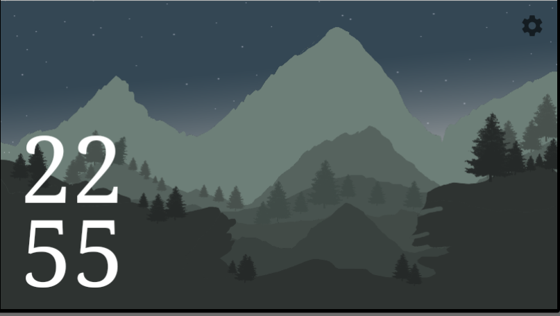
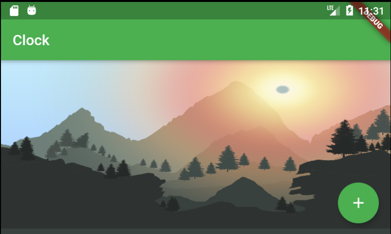

# DayNight Clock

1.	This is a clock that turns its background shades of sunlight as per the changing time.
For instance, when the time is 10:55 PM (22:55), the background screen turns into night mode.

2.	Same way, there are different shades of the light as given below, captured from the demo app as the time is out for me to capture the screenshots on the live app.
3.	From the demo app, the sunlight on the display changes as the “+” button is clicked.

